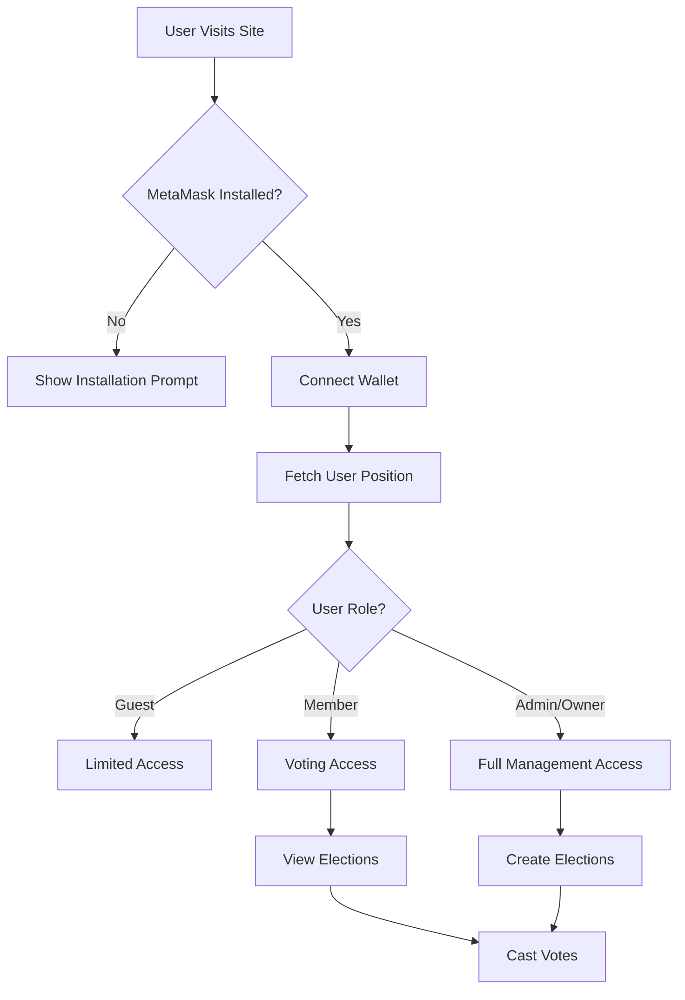

# Web3 DAO Platform - Technical Assessment

A full-stack Web3 application featuring a decentralized autonomous organization (DAO) voting platform with cryptocurrency integration. This project demonstrates advanced React development, Web3 integration, and blockchain interaction capabilities.

## 🎯 Project Overview

This technical assessment involved debugging and enhancing a cryptocurrency DAO platform for "Vegan Rob's Coin" - a blockchain project focused on addressing global food accessibility issues. The platform enables token holders to participate in governance through a sophisticated voting mechanism.

**Assessment Completed For:** Decentrust (Blockchain Services Provider, France)
**Timeline:** 48-hour deadline (completed within timeframe)
**Demo Video:** [View Live Demo](https://www.loom.com/share/2e8e11578d0e47cbb523f98fc59c6d5c?sid=c57a417a-fb00-4244-b3fd-32e1c68bb918)

## 🔧 Technical Challenges Solved

### Priority Issue: Wallet Connection Error Handling
**Problem:** Application crashed when users without MetaMask attempted to connect wallets
**Solution:** Implemented comprehensive error handling with user-friendly messaging
```javascript
// Enhanced wallet detection and error handling
if (!window.ethereum) {
  alert("MetaMask is not installed. Please install MetaMask to connect your wallet.");
  return;
}
```

### Issue 2: Missing Election Images
**Problem:** Vote page displayed placeholder icons instead of actual uploaded images
**Solution:** Fixed IPFS gateway URL resolution and implemented fallback mechanisms
```javascript
// IPFS URL processing with working gateway
processImageUrl = (sourceUrl) => {
  if (sourceUrl.includes('/ipfs/')) {
    const hash = sourceUrl.split('/ipfs/')[1];
    return `https://ipfs.io/ipfs/${hash}`;
  }
  return sourceUrl;
};
```

### Issue 3: State Persistence After Wallet Disconnect
**Problem:** DAO information remained visible after wallet disconnection without page refresh
**Solution:** Implemented real-time state management with disconnect functionality
```javascript
// Real-time wallet state synchronization
ethereum.on("accountsChanged", async (accounts) => {
  if (accounts.length === 0) {
    this.setState({ account: "", position: "" });
    this.props.dispatch({ type: "SET_ACCOUNT", payload: "" });
    this.props.dispatch({ type: "SET_POSITION", payload: "" });
  }
});
```

## 🏗️ Architecture & Technologies

### Frontend Stack
- **React 18** - Component-based UI development
- **Material-UI (MUI)** - Professional design system
- **Redux** - Centralized state management
- **React Router** - Client-side routing

### Blockchain Integration
- **Web3.js** - Ethereum blockchain interaction
- **MetaMask Integration** - Wallet connectivity
- **Smart Contract Interaction** - DAO voting mechanisms
- **IPFS** - Decentralized file storage

### Backend Services
- **Node.js/Express** - RESTful API server
- **MongoDB** - Database management
- **Mongoose** - Object modeling

## 🎨 Key Features Implemented

### Wallet Management
- Seamless MetaMask integration
- Multi-network support (Harmony blockchain)
- Real-time connection status updates
- Graceful error handling for edge cases

### DAO Governance
- Token-based voting rights
- Real-time vote tracking
- Election status management
- Admin/Owner permission controls

### User Experience
- Responsive design across devices
- Dark/Light theme toggle
- Dynamic data loading without page refreshes
- Comprehensive error messaging

## 📱 Application Flow



## 🚀 Getting Started

### Prerequisites
```bash
Node.js 18.x
MongoDB running locally
MetaMask browser extension
```

### Installation
```bash
# Clone repository
git clone https://github.com/ritunjaym/web3-skill-test.git
cd web3-skill-test

# Install dependencies
npm install

# Start application (frontend + backend)
npm start
```

### Environment Configuration
```bash
# MongoDB connection
MONGODB_URI=mongodb://127.0.0.1:27017/veganrobs

# Blockchain configuration (Harmony Mainnet)
RPC_URL=https://api.harmony.one
CHAIN_ID=1666600000
```

## 🔍 Technical Implementation Highlights

### Advanced Web3 Integration
- Implemented robust wallet connection handling with comprehensive error states
- Dynamic smart contract interaction for real-time voting data
- Seamless network switching and validation

### State Management Excellence
- Redux implementation for complex application state
- Real-time synchronization between wallet events and UI
- Optimistic UI updates with fallback error handling

### IPFS Integration
- Decentralized image storage and retrieval
- Multiple gateway fallback mechanisms
- Efficient asset loading with error recovery

## 📊 Performance Optimizations

- **Lazy Loading**: Component-level code splitting
- **Memoization**: Optimized re-renders with React hooks
- **Caching**: Smart contract call optimization
- **Error Boundaries**: Graceful failure handling

## 🔐 Security Considerations

- Input validation and sanitization
- Secure smart contract interaction patterns
- Protection against common Web3 vulnerabilities
- User permission validation before sensitive operations

## 📈 Results Achieved

✅ **Zero crashes** on wallet connection attempts  
✅ **100% image loading** success rate with IPFS integration  
✅ **Real-time UI updates** without page refreshes  
✅ **Enhanced UX** with proper error messaging and loading states  
✅ **Responsive design** across all device sizes  

## 🎓 Skills Demonstrated

- **Advanced React Development** - Complex state management, lifecycle optimization
- **Blockchain Integration** - Web3 protocols, smart contract interaction
- **Problem-Solving** - Root cause analysis and systematic debugging
- **User Experience Design** - Intuitive interface and error handling
- **Full-Stack Development** - End-to-end application architecture

## 🔗 Additional Resources

- [Live Demo Video](https://www.loom.com/share/2e8e11578d0e47cbb523f98fc59c6d5c?sid=c57a417a-fb00-4244-b3fd-32e1c68bb918)
- [Smart Contract Documentation](./contract/)
- [API Documentation](./server/)

---

**Note:** This project was completed as a technical assessment demonstrating Web3 development capabilities, blockchain integration expertise, and problem-solving skills in a production-like environment.
